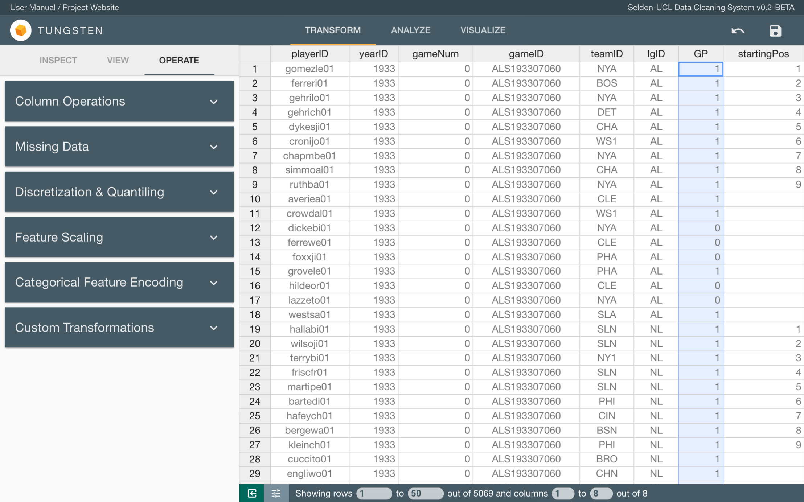

This page is a work-in-progress, some descriptions may be incomplete/inaccurate. If you have any queries, please contact the team via our GitHub repo.

# Data Uploading and Downloading

    <ol>
        <li><a href="#load-upload">Uploading Data</a>
            <ol type="a">
                <li><a href="#load-upload-largeFiles">Large Files</a></li>
                <li><a href="#load-upload-commonIssues">Common Issues</a></li>
            </ol>
        </li>
        <li><a href="#load-download">Saving/Downloading Data</a></li>
    </ol>

## Uploading Data

You need to first upload your data into Tungsten in order to perform any operations. Uploading a dataset creates a new Tungsten project. Unlike common web services, *uploading* a file in Tungsten actually stores the project locally on your computer and **not** on the internet. This means that Tungsten works even if you're offline! Tungsten currently supports **CSV**, **JSON**, **XLS**, and **XLSX** formatted data files.

When you access Tungsten using the appropriate address in your web browser, you will be directed to the Upload page. To upload a new file, click the gray box in the middle. This will open a file explorer, simply select the file you want and click *Open*. Alternatively, you can select a file by dragging the file inside the gray box. Click *Upload* to upload the selected file. If the upload is successful, you will be directed to the clean tab in main page.

### Large Files

If you select a large file to upload, the advanced options section will expand automatically and warn you about potential performance issues. This is because even with the optimisations we have implemented in Tungsten for dealing with large datasets, its performance will unavoidably degrade as the file size increases.

In this situation, you can choose to upload your file anyway. However, **do** expect degraded performances from Tungsten. Alternatively, if you don't need all of the data in the file, you can select a random sample of your dataset by specifying a percentage (0, 100] under *Advanced Options*. You can also select a seed so you can retrieve the same sample again in the future.

### Common Issues

#### Comments at the start of the file

- Some CSV/XLSX files have comments at the start of the file which are not part of the dataset. While Tungsten may accept the file, the resulting data structure will likely not to be correct. Luckily, under *Advanced Options*, you can specify the number of initial lines to ignore when uploading your file. If you do so, Tungsten will skip those lines when parsing your file.

#### Invalid formats

- While Tungsten is a great tool for cleaning datasets, it wasn't built for dealing with invalid data files. However, it will make its best attempt at parsing your file by **removing** invalid records. If Tungsten was not able to parse your file, you will have to fix them before being able to upload them into Tungsten.

#### Text encoding issues

- Text encoding discrepancies may result in Tungsten not accepting your file. Tungsten works in **UTF-8**, while it will do its best to detect the encoding of your file using the excellent [chardet](https://chardet.github.io/) library and convert it to UTF-8, it doesn't always succeed. In these cases, you will have to convert the file yourself before uploading it again.

## Saving/Downloading Data

After you have finished operating on the data, you can download it back in **CSV** or **JSON** formats. To do this, simply click on the <i class="material-icons md-16">save</i> button on the right of the top bar. You may be able to access a previously uploaded dataset by going to the same URL as the one generated when the data was first uploaded. However, this is **not guaranteed** and it is recommended that you save your dataset as a CSV or JSON file between sessions.

 

# Data Viewing

After Tungsten has successfully parsed your data file, you will be directed to the **Transform** tab in the main page. The Transform tab consists of two parts, the toolbar on the right and the data table on the left.

    <ol>
        <li><a href="#view-layout">Interface</a>
            <ol type="a">
                <li><a href="#view-layout-dataTable">Data Table</a></li>
                <li><a href="#view-layout-toolbar">Toolbar</a></li>
            </ol>
        </li>
        <li>Filter
            <ol type="a">
                <li>Duplicates</li>
                <li>Missing/Invalid Values</li>
                <li>Outliers</li>
            </ol>
        </li>
        <li>Sort</li>
        <li>Search</li>
    </ol>

## Interface

### Data Table

The data table is where your dataset is displayed and works similarly to spreadsheets software such as Excel. You can select cells by clicking on them; select multiple cells by dragging; and select entire column or row by clicking on the column or row headers. Initially, the table will show the first 10 columns and first 50 rows and you can navigate between these rows by scrolling inside the table. 

The bar beneath the table (bottom bar) has 2 modes, you can toggle between them by clicking on the <i class="material-icons md-16">tune</i> button on the left side of the bar. The first mode, is table navigation. As mentioned, by default, the table will show the first 10 columns and first 50 rows; you can change which columns/rows to show by editing the values in this bar. The table can show a maximum of 20 columns and 500 rows at once.

The second mode is quick inspect. This shows 3 properties of the column that is currently selected, the column data type, the column mode, and the number of missing/invalid values in the column.

### Toolbar

The toolbar is where you will perform all cleaning and transformation operations. The toolbar has 3 sections, inspect, view, and operate; you can switch between them by clicking on their tabs. The Inspect section shows you the various properties and statistics of the currently selected column. The View sections lets you set filters to what is shown on the data table, and also search through the dataset. The Operate section lets you perform the various operations. These operations are separated into cards and they will show according to your current table selection, click the arrow on the right to expand these cards.

 

# Data Cleaning and Transformation

After Tungsten has successfully parsed your data file, you will be directed to the **Transform** tab in the main page. The Transform tab allows you to perform various data cleaning and transformation operations that Tungsten offers.

    <ol>
        <li><a href="#clean-edit-column">Edit Column</a>
            <ol type="a">
                <li><a href="#clean-edit-column-date">Date Format String</a></li>
                <li><a href="#clean-edit-column-delete">Delete Column and Dealing with Empty Strings</a></li>
            </ol>
        </li>
        <li><a href="#clean-edit-row">Edit Row</a></li>
        <li><a href="#clean-edit-cell">Edit Cell</a></li>
        <li><a href="#clean-column-operations">Column Operations</a>
            <ol type="a">
              <li><a href="#clean-column-operations-duplicate">Duplicate Column</a></li>
              <li><a href="#clean-column-operations-split">Split Column</a></li>
              <li><a href="#clean-column-operations-combine">Combine Columns</a></li>
            </ol>
        </li>
        <li><a href="#clean-missing-data">Missing Data</a>
            <ol type="a">
              <li><a href="#clean-missing-data-average">Impute With Column Average</a></li>
              <li><a href="#clean-missing-data-neighboring">Impute With Neighboring Valid Value</a></li>
              <li><a href="#clean-missing-data-interpolation">Impute Using Interpolation</a></li>
              <li><a href="#clean-missing-data-custom">Impute With Custom Value</a></li>
              <li><a href="#clean-missing-data-delete">Delete Entire Row</a></li>
            </ol>
        </li>
        <li><a href="#clean-discretization">Discretization & Quantiling</a></li>
        <li><a href="#clean-feature-scaling">Feature Scaling</a></li>
        <li><a href="#clean-feature-encoding">Categorical Feature Encoding</a></li>
        <li><a href="#clean-custom-transformation">Custom Transformations</a>
            <ol type="a">
              <li><a href="#clean-custom-transformation-find-replace">Find & Replace</a></li>
              <li><a href="#clean-custom-transformation-batch">Batch Replacement Queue</a></li>
            </ol>
        </li>
        <li><a href="#clean-danger-zone"><em>Highway to the Danger Zone</em></a></li>
    </ol>

## Edit Column

When you select one whole column, the *Edit Column* card will appear under the View section. In this card, you can change the column name and data type. 

<i class="material-icons md-16">error_outline</i> It is <strong>not</strong> recommended to have duplicate column names.

Which data types you will be allowed to change your column to will depend on the current type. You can check the current type in quick inspect.

<table>
<tbody><tr class="headerRow"><td>Current Type</td>
<td width="60%">Possible Options</td>
</tr>
<tr><td>object/str</td>
<td>datetime64, float64, int64</td>
</tr>
<tr><td>int64</td>
<td>str, float64</td>
</tr>
<tr><td>float64</td>
<td>str, int64</td>
</tr>
<tr><td>datetime64</td>
<td>str</td>
</tr>
</tbody>
</table>

**N.B.** You will **not** be able to change the type of a column if the column has missing/invalid values. Refer to the *Missing Data* section for ways to deal with missing values.

### Date format string

When changing a column to type datetime64, you can specify a format string, this will make sure that Tungsten will interpret the date values correctly. Date strings format in Tungsten is the same as Python's `strftime`, documented [here](https://docs.python.org/2/library/datetime.html#strftime-and-strptime-behavior). Here are some commonly used directives:

<table>
<tbody><tr class="headerRow"><td>Directives</td>
<td width="60%">Meaning</td>
</tr>
<tr><td>%d</td>
<td>Day of month as a decimal number.</td>
</tr>
<tr><td>%m</td>
<td>Month as a decimal number.</td>
</tr>
<tr><td>%Y</td>
<td>Year with century as a decimal number.</td>
</tr>
<tr><td>%H</td>
<td>Hour (24-hour clock) as a decimal number.</td>
</tr>
<tr><td>%M</td>
<td>Minute as a decimal number.</td>
</tr>
</tbody>
</table>

For example, here is 20:18 on July 20th, 1969 in different date-time formats:

<table>
<tbody><tr class="headerRow"><td>Date-time</td>
<td width="60%">Format String</td>
</tr>
<tr><td>20/07/69-20:18</td>
<td><code>%d/%m/%y-%H:%M</code></td>
</tr>
<tr><td>July 20, 1969 (8:18pm)</td>
<td><code>%B%d,%Y(%I:%M%p)</code></td>
</tr>
</tbody>
</table>

#### **Quirks**

- Conversion to datetime64 will fail if **any** values in the column cannot be converted to datetime64.

### Delete column and dealing with empty strings

Other than changing column name and data type, you can also delete the column entirely by clicking *Delete Selected Column*.

For object/str typed columns, you can convert all empty strings to invalid values by clicking *Treat Empty Strings as Invalid Values*, this can be useful when you're trying to impute missing data.

## Edit Row

When you select one or more rows, the *Edit Row(s)* card will appear under the View section. In this card, you can delete the rows you have selected by clicking the *Delete Selected Row(s)* button. 

## Edit Cell

When you select a single cell, the *Edit Cell* card will appear under the View section. In this card, you can change the value of the selected cell. Tungsten will attempt to convert the entered value back to the data type of the column the cell is in, e.g. 33 to int rather than literal string. However, it may *not* be successful at doing so. In these cases, Tungsten will treat the value as a string and convert all values in the column to type Object.

## Column Operations

When you select a single column, the *Column Operations* card will appear under the Operate section.

### Duplicate Column

This option makes a copy of the currently selected column and insert it to the right of the original.

### Split Column

This option splits each value in the selected column using a specified delimiter, put them into multiple columns and inserts them to the right of the original. For example, splitting the following column using the delimiter '/'...

<table style="max-width: 200px">
<tbody><tr class="headerRow"><td>Date</td>
</tr>
<tr><td>20/07/1969</td>
</tr>
<tr><td>21/07/1969</td>
</tr>
<tr><td>22/07/1969</td>
</tr>
<tr><td>23/07/1969</td>
</tr>
<tr><td>24/07/1969</td>
</tr>
<tr><td>...</td>
</tr>
</tbody>
</table>

... will result in the following columns.

<table>
<tbody><tr class="headerRow"><td>Date</td>
<td>Date_0</td>
<td>Date_1</td>
<td>Date_2</td>
</tr>
<tr><td>20/07/1969</td>
<td>20</td>
<td>07</td>
<td>1969</td>
</tr>
<tr><td>21/07/1969</td>
<td>21</td>
<td>07</td>
<td>1969</td>
</tr>
<tr><td>22/07/1969</td>
<td>22</td>
<td>07</td>
<td>1969</td>
</tr>
<tr><td>23/07/1969</td>
<td>23</td>
<td>07</td>
<td>1969</td>
</tr>
<tr><td>24/07/1969</td>
<td>24</td>
<td>07</td>
<td>1969</td>
</tr>
<tr><td>...</td>
<td>...</td>
<td>...</td>
<td>...</td>
</tr>
</tbody>
</table>

The names of the new columns will be in the format: *original-name_(n-1)* where n is the nth column generated.

#### **Quirks**

All empty strings in the newly generated columns will be treated as invalid values. However, the original column will be **unaffected**.

### Combine Columns

This option combines values of multiple columns into a single column using an optional separator and inserts it in the selected column's position. 

Unlike most other operations, the selection of columns to operate on is **not** done via the data table. To add a column to the list of columns to combine, type the column name into the text field, select the column you want and click *Add*. You **must** have 2 or more columns in order to perform this operation. 

You can specify a separator that will be inserted between the values-to-combine; the separator can be one or more non-whitespace characters. The name for the new column generated **must** be provided, this name must be unique. Click *Combine Columns* after you've finished all configurations.

Tungsten will convert all values to strings and combine them by concatenating the values one-by-one, starting from the first column. The resulting column will be of type Object. For example, having selected the columns Year, Month, Day in this order, separator set as '-', new column name set as 'Date' and having selected the column Year on the data table...

<table>
<tbody><tr class="headerRow"><td>Year</td>
<td>Month</td>
<td>Day</td>
</tr>
<tr><td>1969</td>
<td>07</td>
<td>20</td>
</tr>
<tr><td>1969</td>
<td>07</td>
<td>21</td>
</tr>
<tr><td>1969</td>
<td>07</td>
<td>22</td>
</tr>
<tr><td>1969</td>
<td>07</td>
<td>23</td>
</tr>
<tr><td>1969</td>
<td>07</td>
<td>24</td>
</tr>
<tr><td>...</td>
<td>...</td>
<td>...</td>
</tr>
</tbody>
</table>

... will result in the following columns.

<table>
<tbody><tr class="headerRow"><td>Date</td>
<td>Year</td>
<td>Month</td>
<td>Day</td>
</tr>
<tr><td>1969-07-20</td>
<td>1969</td>
<td>07</td>
<td>20</td>
</tr>
<tr><td>1969-07-21</td>
<td>1969</td>
<td>07</td>
<td>21</td>
</tr>
<tr><td>1969-07-22</td>
<td>1969</td>
<td>07</td>
<td>22</td>
</tr>
<tr><td>1969-07-23</td>
<td>1969</td>
<td>07</td>
<td>23</td>
</tr>
<tr><td>1969-07-24</td>
<td>1969</td>
<td>07</td>
<td>24</td>
</tr>
<tr><td>...</td>
<td>...</td>
<td>...</td>
<td>...</td>
</tr>
</tbody>
</table>

#### **Quirks**

Behind the scenes, Tungsten uses the Python `join` function to combine the values. So, for example, combining 6 empty strings using `'%'` as separator will result in the value `'%%%%%'`. However, Tungsten **does** ignore invalid values (NaN/NA) when combining. Because of this, combining...

    (nan), 'abc', (nan), (empty string) 

... with `'%'` will result in the value `'abc%'`. You can convert all empty strings in a column to NaNs by selecting that column, go to *Edit Columns* under View, and click *Treat Empty Strings as Invalid Values*.

## Missing Data

When you select a single column, the *Missing Data* card will appear under the Operate section.

### Impute With Column Average

Depending on the data type of the selected column, you can choose to impute all invalid/missing values in the column with:

- The column mean (if the column is of a numerical type)
- The column median (if the column is of a numerical type)
- The column mode aka most frequent value (works on all data types)

#### **Quirks**

- Imputing with column mean on an int64 typed column will change it to type float64.
- If the column has more than one mode, Tungsten will arbitrarily choose one to use for filling.

### Impute With Neighboring Valid Value

This gives you 2 options, *forward fill* and *backward fill*. Their behaviour is illustrated below.

<table>
<tbody><tr class="headerRow"><td>Original</td>
<td>Forward Filled</td>
<td>Backward Filled</td>
</tr>
<tr><td></td>
<td></td>
<td>Euston Square</td>
</tr>
<tr><td></td>
<td></td>
<td>Euston Square</td>
</tr>
<tr><td>Euston Square</td>
<td>Euston Square</td>
<td>Euston Square</td>
</tr>
<tr><td></td>
<td>Euston Square</td>
<td>King's Cross St. Pancras</td>
</tr>
<tr><td></td>
<td>Euston Square</td>
<td>King's Cross St. Pancras</td>
</tr>
<tr><td>King's Cross St. Pancras</td>
<td>King's Cross St. Pancras</td>
<td>King's Cross St. Pancras</td>
</tr>
<tr><td>Waterloo</td>
<td>Waterloo</td>
<td>Waterloo</td>
</tr>
<tr><td></td>
<td>Waterloo</td>
<td>Goodge Street</td>
</tr>
<tr><td>Goodge Street</td>
<td>Goodge Street</td>
<td>Goodge Street</td>
</tr>
<tr><td>...</td>
<td>...</td>
<td>...</td>
</tr>
</tbody>
</table>

**N.B.** As illustrated above, when performing forward fill, if the first row of the original column has a missing value, all missing values until the **first** valid value will not be filled. This applies similarly to backward fill if the last row has a missing value.

### Impute Using Interpolation

*To be written...*

### Impute With Custom Value

This option fills in missing values with a custom specified value. Tungsten will attempt to convert the entered value back to the data type of the column the cell is in, e.g. 33 to int rather than literal string. However, it may *not* be successful at doing so. In these cases, Tungsten will treat the value as a string and convert all values in the column to type Object.

### Delete Entire Row

This option deletes (i.e. removes from the table) all rows containing an invalid/missing value in the selected column.

## Discretization & Quantiling

When you select a single column of a numeric type, the *Discretization & Quantiling* card will appear under the Operate section. This option partitions continuous features to discretized intervals by putting them into bins. Discretization put values into evenly spaced bins **according to the values themselves**. On the other hand, quantiling put values into evenly sized bins **according to the values frequencies**. The following example illustrates the behaviour when a column is discretized and quantiled with 5 bins.

<table>
<tbody><tr class="headerRow"><td>Original</td>
<td>Discretized</td>
<td>Quantiled</td>
</tr>
<tr><td>0</td>
<td>(-0.01, 2]</td>
<td>[0, 1.8)</td>
</tr>
<tr><td>1</td>
<td>(-0.01, 2]</td>
<td>[0, 1.8]</td>
</tr>
<tr><td>2</td>
<td>(-0.01, 2]</td>
<td>(1.8, 4.2]</td>
</tr>
<tr><td>3</td>
<td>(2, 4]</td>
<td>(1.8, 4.2]</td>
</tr>
<tr><td>5</td>
<td>(4, 6]</td>
<td>(4.2, 6.4]</td>
</tr>
<tr><td>6</td>
<td>(4, 6]</td>
<td>(4.2, 6.4]</td>
</tr>
<tr><td>7</td>
<td>(6, 8]</td>
<td>(6.4, 8.2]</td>
</tr>
<tr><td>8</td>
<td>(6, 8]</td>
<td>(6.4, 8.2]</td>
</tr>
<tr><td>9</td>
<td>(8, 10]</td>
<td>(8.2, 10]</td>
</tr>
<tr><td>10</td>
<td>(8, 10]</td>
<td>(8.2, 10]</td>
</tr>
</tbody>
</table>

Instead of having evenly spaced/sized bins, you can set custom intervals and quantiles. Check the *Custom Ranges/Quantiles* option and input a comma-seperated list of ranges/quantiles. The following example shows the behaviour when a column is discretized with the ranges: `-0.01, 2.5, 5, 10`; and quantiled with the qunatiles: `0, 0.25, 0.5, 1`.

<table>
<tbody><tr class="headerRow"><td>Original</td>
<td>Discretized</td>
<td>Quantiled</td>
</tr>
<tr><td>0</td>
<td>(-0.01, 2.5]</td>
<td>[0, 2.25]</td>
</tr>
<tr><td>1</td>
<td>(-0.01, 2.5]</td>
<td>[0, 2.25]</td>
</tr>
<tr><td>2</td>
<td>(-0.01, 2.5]</td>
<td>[0, 2.25]</td>
</tr>
<tr><td>3</td>
<td>(2.5, 5]</td>
<td>(2.25, 5.5]</td>
</tr>
<tr><td>5</td>
<td>(2.5, 5]</td>
<td>(2.25, 5.5]</td>
</tr>
<tr><td>6</td>
<td>(5, 10]</td>
<td>(5.5, 10]</td>
</tr>
<tr><td>7</td>
<td>(5, 10]</td>
<td>(5.5, 10]</td>
</tr>
<tr><td>8</td>
<td>(5, 10]</td>
<td>(5.5, 10]</td>
</tr>
<tr><td>9</td>
<td>(5, 10]</td>
<td>(5.5, 10]</td>
</tr>
<tr><td>10</td>
<td>(5, 10]</td>
<td>(5.5, 10]</td>
</tr>
</tbody>
</table>

#### **Quirks**

- When setting custom intervals, make sure that the first value is less than the minimum value of the column. Otherwise the minimum value will become blank when being discretized.
- When a column is discretized/quantiled, the column type will change to Object and the values will act like strings.

## Feature Scaling

When you select a single column of a numeric type, the *Feature Scaling* card will appear under the Operate section.

## Categorical Feature Encoding

When you select a single column of a numeric type, the *Categorical Feature Encoding* card will appear under the Operate section. This option encode categorical features using a one-hot scheme, i.e. converts each record of the column to a combination of a single high (1) bit and zero or more low (0) bits.